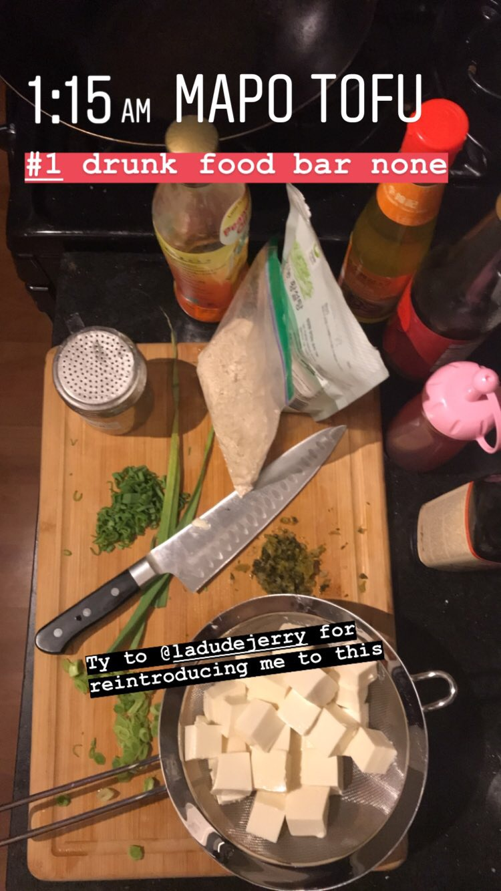
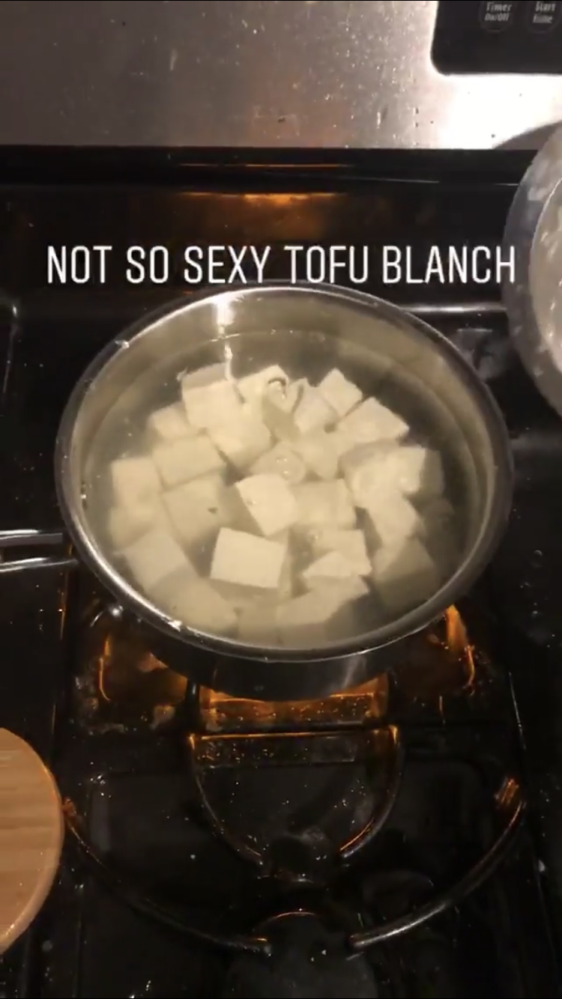
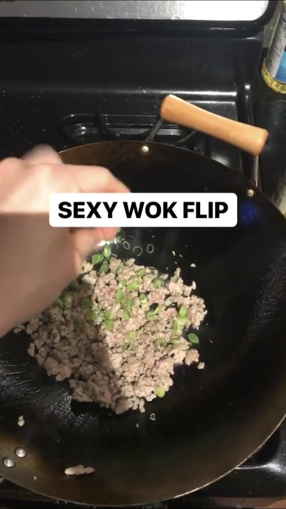
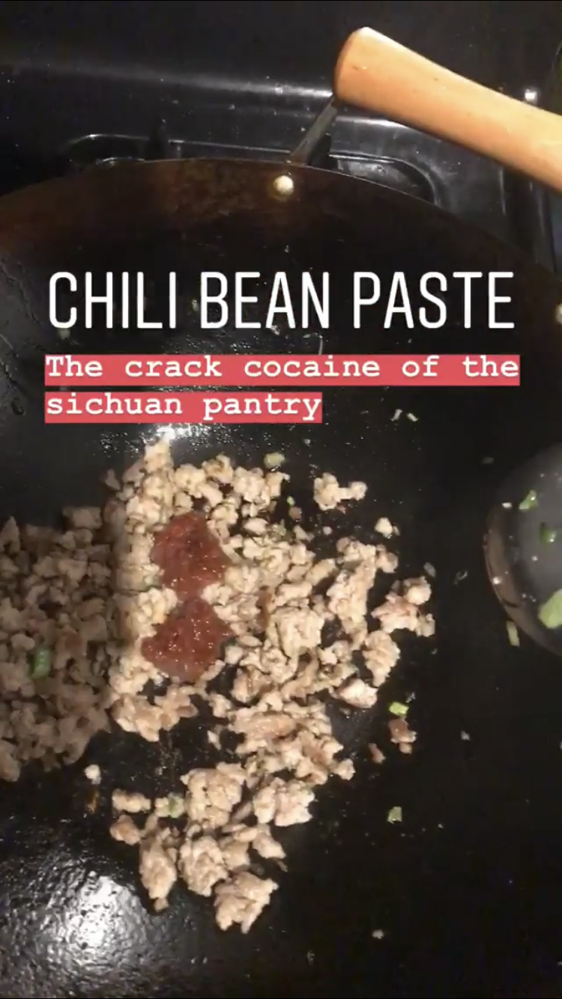
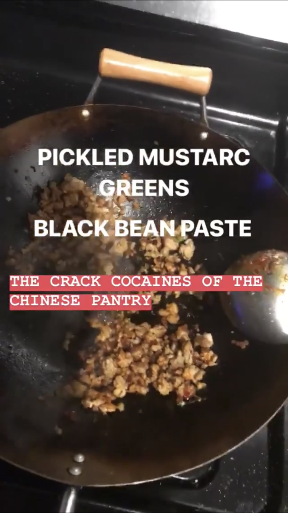
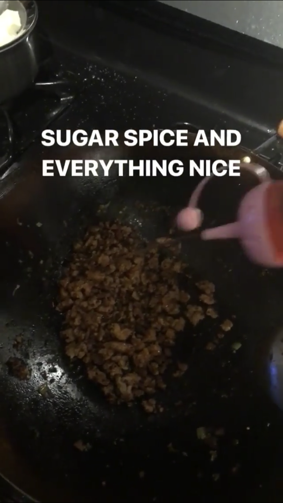
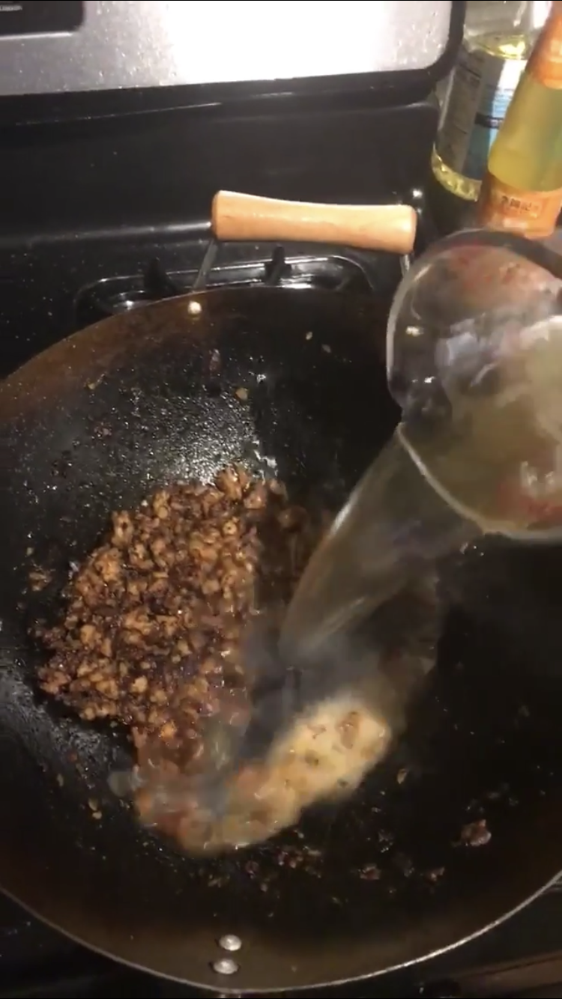
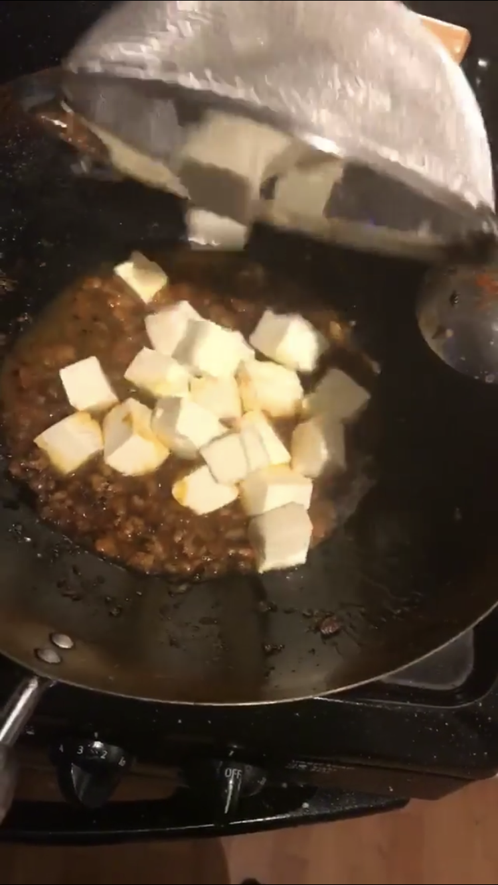
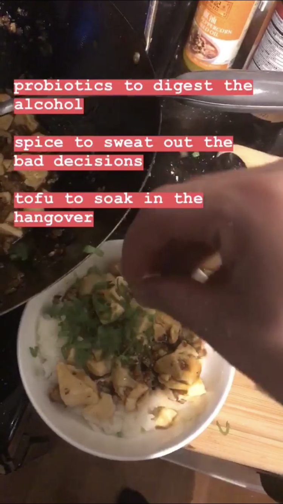

# Mapo Tofu Overexplained

IMO mapo tofu has the highest reward to effort ratio of any Chinese food. The core part of the recipe is super simple with only one obscure ingredient (which isn't even that hard to find since we live in a global™ society now), and it's a pretty forgiving dish. There's a lot of room to fuck around and it'll still taste good, although you should taste frequently while cooking since a lot of these ingredients are salty and you don't want to oversalt.

I like my mapo tofu to be really heavy on umami (toomami?) and oil, with a thick sauce that coats the rice and spicy/numbing enough to be slightly uncomfortable. The flavor should be absorbed into the tofu, and the meat is mostly there for a bit more flavor and a flaky texture.

## Format
I'm starting with the core recipe. Ways to build on this will be italicized and explained below. At the bottom is what I personally do as well as the traditional recipe.

## Ingredients
| Ingredient                | Amount            | Details   |
| ------------------------- | ----------------- | --------- |
| ground pork/ground beef   | 1/2 lb            | Whichever you like better, I'm p sure pork is more traditional, but don't quote me on that |
| tofu (cut into 1in cubes) | 1 package (18 oz) | Silken is best imo, but you can fuck with any firmness if you’re weird. Get the refridgerated plastic tubs instead of the boxes |
| doubanjiang               | 1 tbsp            | This is the one obscure ingredient you can’t really go without. Also known as broad bean paste, chili bean paste/sauce, usually sold in jars in the sauces section of Asian markets, though I’ve seen legit doubanjiang at QFC too. If you can, get one that says Pixian on the jar cause that’s the region of Sichuan where they’re famous for making this. Lee Kum Kee brand is a bit too sweet/not really fermented, but it's ok if that's all you can find. |
| cornstarch                | 1 tbsp            | This is basically to just thicken the sauce at the end. You can add more if you want the sauce to be thicker |
| salt                      | 1 tbsp or so      | Basically only used for the blanching step, other ingredients provide saltiness to the actual dish |
| water                     | 1 cup             | This is the liquid that creates the sauce. You can also use broth instead (explained below) to add some gelatin and additional flavor |
| neutral flavored oil      | 2 tbsp            | I use peanut, but canola/vegetable works just as well |

### 1. Prep your ingredients
  Everything gets cooked really fast, so make sure everything is out and _your aromatics are already chopped_.

  

### 2. Blanch tofu
  This basically helps your tofu absorb flavor later. Boil a pot of water (enough to cover tofu) and salt it (about the same as you’d salt pasta water, maybe ~1tbsp per quart of water). Boil tofu for two minutes (this is for silken tofu, idk what it is for other firmnesses), then drain water and set aside tofu.

  

### 3. Cook dry ingredients
  Heat a wok/skillet on medium-high. When it’s hot, throw in a tablespoon or two of oil. Toss in pork/beef. You don’t need to add salt here cuz half the other ingredients are salty af. Break the meat into little pieces, and cook until most of the liquid is evaporated. _Toss in aromatics_. Keep stirring/cooking until meat is no longer pink.

  

### 4. Stir in salty/umami ingredients
  Stir in doubanjiang — _unless you're using fermented black beans or pickled mustard greens_, you should add in enough so that it’s about as salty as you want the final dish to be since this is your main salt ingredient. _Add in other umami ingredients_ and cook for a minute or so.
  
  

### 5. Add liquid and tofu
  _Add flavoring oils._ Stir your cornstarch/potato starch/flour into your water/broth (so that you don’t get clumps of starch in your food). Add this mixture to the meat. Throw in the tofu as well. Simmer for a few minutes to thicken the sauce.

  
  
### 6. Adjust
  This is where you want to adjust saltiness/consistency/flavor. Add salt if undersalted, stir in some cornstarch if sauce needs to be thicker, _add a splash of vinegar and a pinch of sugar for a bit of brightness_, etc.
### 7. Garnish and serve
  Scoop onto a bowl of rice. _Add on toppings and ground peppercorn, if using, to add a bit of freshness and make things look pretty lol_

  

  And that's basically it!

## Modifications
You can add any combination of these ingredients/substitutions to build on top of this.

### To add flavor:
1. __Use broth instead of water for the sauce__ — I think it's a little bland with just water, so I usually use broth instead. Usually chicken or vegetable. If you make your own broth, it'll add gelatin too, which'll make the sauce feel nicer. You can also fuck around with using light beer or dashi instead of water.

2. __Add aromatics when cooking the meat__ — You can also build more flavor by adding aromatics. Green garlic (the white and light green parts only, chopped), garlic (minced), scallions (the white and light green parts only, chopped), and ginger (chopped or if you're feeling frisky, julienned) are the classic ones for Chinese cooking. You can use any combination of the above. Amounts: about 1 tbsp of garlic, about 1 tbsp of ginger, about 1/4 of a cup of scallions, 1/4 of a cup of green garlic, but it's pretty forgiving. I like green garlic/scallions cuz you can chop the darker green parts to use as a garnish.

3. __Sugar and acid__ — These help the flavors open up a bit more. A splash of vinegar (black rice vinegar preferred) and a tsp of sugar are good.

### To add umami:
You can use the following to add more umami to this dish. The traditional way is to use fermented black beans only.

| Ingredient                     | Amount            | Details   |
| ------------------------------ | ----------------- | --------- |
| Fermented black beans (minced) | 1 tbsp            | These are super salty and basically pure umami. Rinse these before using to get rid of some of the salt. Be careful how much you use or else they'll overwhelm your dish since they're so salty. You can also soak them in warm water for 10 minutes and then rinse them again to get rid of some of the salt. If you use these, use a bit less doubanjiang to compensate for salt. Brand shouldn't matter much for these. |
| MSG/Mushroom powder            | 1 tsp             | These are basically the same thing (chemical umami), but mushroom powder has less of a stigma. To make mushroom powder, throw a handful of dried shiitake mushrooms in a blender and pulverize into a powder. Homemade mushroom powder is like ground spices and loses potency over time, so don't make too much |
| Fish sauce                     | 1/2 tsp           | Adds a lot of meaty umami to a dish. A small amount goes a long way. Cook for a bit to get rid of the fishy odor. Red Boat brand 40N is the best quality to use. |
| Pickled mustard greens         | 1/4 cup           | Not traditional, but Sichuan food uses a lot of pickled mustard greens, and I think they're delicious. Sui mi ya cai ([pic](https://cdn.shopify.com/s/files/1/1495/7408/products/suimiyacai-packets-contrast.jpg?v=1517952350)) is what's typically used in Sichuan food, but it's really hard to find. Suika in Seattle just uses Japanese pickled mustard greens, you could also use zhacai (pickled mustard stem, which is easier to find) or just make your own lol. Like fermented black beans, you might want to rinse these before using to get rid of some of the salt. |

### To add spiciness
Add chili oil after cooking your dry ingredients until you reach desired spice level. This dish is best with a healthy amount of fat, so you might want to just add more oil anyways lol.

### To add numbing flavor
You can use either ground Sichuan peppercorn or Sichuan peppercorn oil to add the classic numbing fragrance to mapo tofu. Red Sichuan peppercorns are more traditional, green ones are more floral.

I like just using peppercorn oil — I'm not a huge fan of the texture of crushed peppercorns (maybe I'm just bad with a mortar and pestle), and it's easier. But it is a bit overkill to get a bottle of peppercorn oil if you don't make a lot of Sichuan food. About half a tbsp of crushed peppercorn or a teaspoon of peppercorn oil are probably good, depending on how numbing you want this to be.

For ground peppercorn, add this at the end like a garnish. For the peppercorn oil, add this after cooking your dry ingredients.

### Garnishes
Add these on top at the end to make it look prettier and balance the heaviness.

Here are some possible garnishes:
 - __Green garlic (green part, chopped) or scallions (green part, chopped)__ — These are the traditional garnishes.
 - __Cilantro__ — unless you're unlucky and it tastes like soap to you.
 - __Pea shoot microgreens__ — if you're a hipster
 - __Edible flowers__ — if you're a hipster AND pretentious

### Other variations
Danny Bowien cooks some aged beef fat in the pan before adding the meat to add additional fat and flavor. His old version braised the whole thing slowly in the oven (like a bolognese) instead of cooking everything really quickly in a wok.

David Chang uses Korean gochujang instead of doubanjiang to make it more Korean flavored, and instead of having cubes of tofu, he blends the silken tofu and mixes it into the sauce to give it a silkier texture. He then uses this to coat rice cakes.

Yu Bo sometimes uses rice tofu or acorn jelly (dotori-muk)

Japanese variations of this dish use miso, sake, and soy sauce instead of doubanjiang, and add more sugar to make it sweeter.

You can make this vegan by cooking shiitake mushrooms on low heat til they get dry and then using this instead of meat.

## My current variation
 - __Meat__ — 1/2 lb ground pork
 - __Aromatics__ — 1/4 cup of green garlic (white and light green parts only, chopped)
 - __Sauce liquid__ — 1 cup Duck broth, with a separate mix of water and cornstarch (1:1 ratio) to thicken the sauce to taste.
 - __Umami ingredients__ — 1 tsp mushroom powder, 1/2 cup chopped pickled mustard greens, 1 tbsp chopped fermented black beans
 - __Garnish__ — Green garlic (dark green parts, chopped)
 - __Spiciness__ — 1-2 tbsp of chili oil
 - __Numbing flavor__ — 1 tsp of Sichuan peppercorn oil
 - __Other__ — 1 tsp of sugar, 1 tsp of black rice vinegar

 Make according to instructions above

## Traditional variation
 - __Meat__ — 1/2 lb ground pork
 - __Aromatics__ — 1 scallion (white and light green parts only, chopped), 1 tbsp of minced garlic, 1 tbsp of minced ginger
 - __Sauce liquid__ — 1 cup chicken broth, with a separate mix of water and cornstarch (1:1 ratio) to thicken the sauce to taste.
 - __Umami ingredients__ — 1 tbsp chopped fermented black beans, pinch of MSG too ;)
 - __Garnish__ — The dark green parts of the scallion above, chopped
 - __Spiciness__ — 1-2 tbsp of chili oil
 - __Numbing flavor__ — 1 tbsp of ground Sichuan peppercorn
 - __Other__ — 1 tsp of sugar

 Make according to instructions above